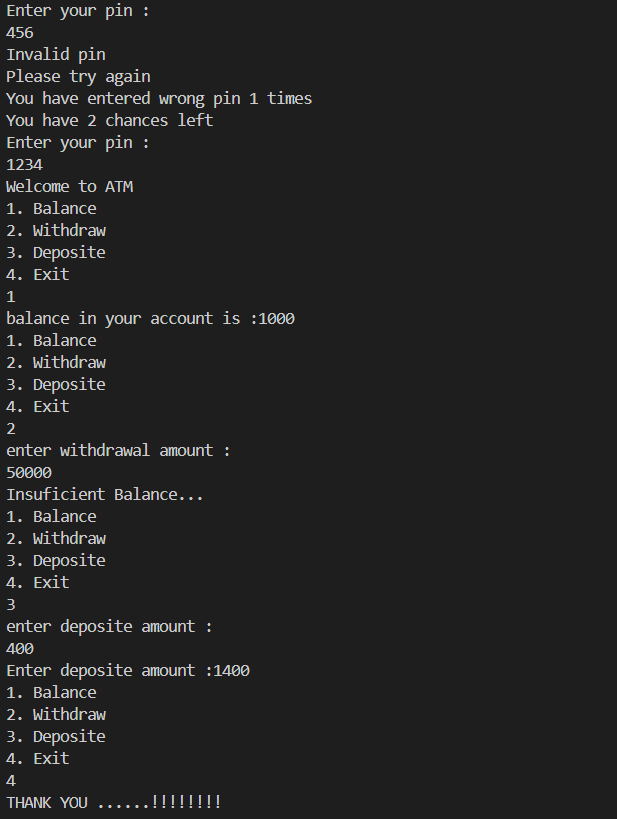
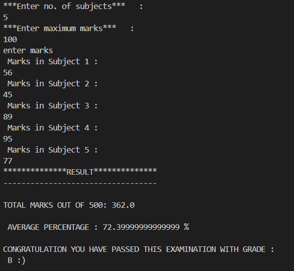
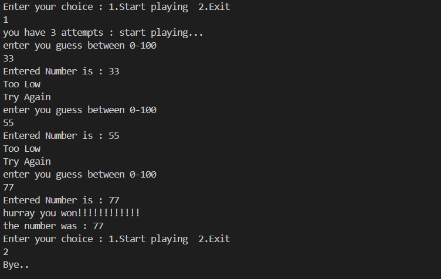

# Simple Java Projects 

A collection of beginner-friendly Java projects i made to practice fundamental programming concepts.

---

- **ATM Simulator**: Perform basic banking operations like checking balance, withdrawing, and depositing money.
- **Grade Calculator**: Compute total marks, percentage, and determine grades based on performance.
- **Random Number Guessing Game**: Guess the correct number within a limited number of attempts with hints provided.

---

### **ATM Simulator 🏦**
1. Run the program and enter the PIN (**default: 1234**).
2. Choose an operation from the menu: **Balance, Withdraw, Deposit, Exit**.
3. Perform transactions based on available balance.
4. Exit the program when done.

---
### **Grade Calculator 📊**
1. Enter the number of subjects.
2. Input the maximum marks per subject.
3. Enter marks for each subject.
4. The program calculates total marks, percentage, and assigns a grade.

---
### **Random Number Guessing Game 🎲**
1. Start the game and guess a number between **1 and 100**.
2. Get hints if your guess is too high or too low.
3. You have **3 attempts** to guess correctly.
4. The correct number is revealed at the end if you fail.

---
